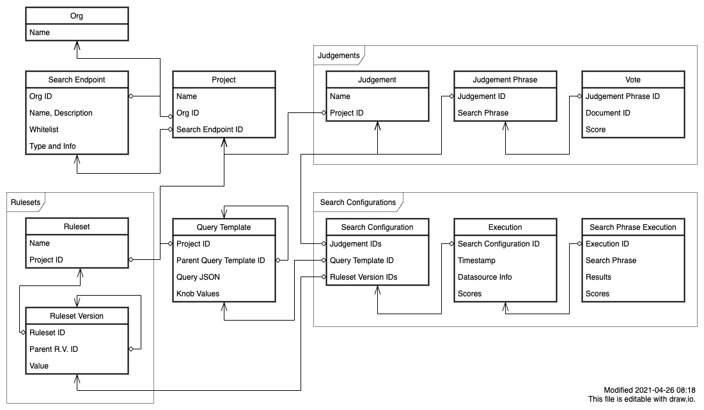

# Project Sierra

Project Sierra is about perfecting search engine relevance using bleeding edge technologies and methodologies.

There are many companies and organizations who have implemented their own search engine internally, or as part of their product - usually by integrating Elasticsearch, OpenSearch or Solr. Attorney offices, websites with a lot of content, and most notably e-commerce websites - all have one thing in common: a lot of data to be searched and the requirement for having search be as fast, effective and relevant as possible. For them, to make data accessible is important because it can improve overall user experience, make users more effective, and in the e-commerce case - make more money.

Project Sierra is the ultimate tool for improving search relevance and results ranking in search engine technologies that are powering search in most organizations today. In most cases a search engine like Solr and Elasticsearch is installed and then just used. There are so many knowledge gaps, but more often than not - just lack of tooling and methodologies to make it really work well for organizations.

This is why we created Project Sierra.

## Purpose

- Improving search relevance for Solr, Elasticsearch and Vespa based search services.
- Collecting judgments for measuring search relevance performance
- Allowing quick iterations for improving full-text search queries
- Managing and measuring search expansion rule systems (synonyms etc)
- Establishing and maintaining performance baseline, and allowing to iterate from there
- Comparing various approaches to search by evaluating different branches
- Canary and A/B testing of search approaches
- Support Machine-Learning based search (Learning To Rank and others)
- Regression testing for CI/CD and production system
- Alerting when desired search performance is degraded.

## How does this work?

We use bleeding edge methods and technologies, and rely on a lot of academic research and our expertise in search relevance engineering.

At the heart of the process is the concept of Judgments. In order to measure how your search engine is doing, we need to somehow tell if the results that are shown are correct and relevant (“precision”), are in the right order (“relevance”), and whether there are better results that are not shown (“recall”).

There are several types of Judgments -

1. Manual and systematic - done by analysts, end users, project managers and other search stakeholders. Since this is highly subjective, ideally we would like to have multiple people rating search results.
2. Feedback loops - allowing feedback from end users like thumbs up / thumbs down etc. This could work at scale, but will be more partial and biased than Manual.
3. Automatic and inferred from search logs and click streams.

Given enough judgments of hopefully more than one type and source, we are able to allow an iterative process of improving the query, configurations, search expansion rules, and so on. “Improving” a search engine in this context would be optimizing select parameters, usually the order of results that we know are good (based on judgments), but can also be conversion, margins in the e-commerce case, and so on.

Based on those judgements we can create a well-defined iterative process that can show when there's progress and alert when there's regression. Then we can safely iterate on index mapping, query json, knobs, rulesets, synonyms and more.

## Getting started

1. Create a new Search Endpoint (see below for available clusters with demo data).
2. Create a new Project, selecting the Search Endpoint you created.
3. From the list of projects (available on home screen), go to Lab for the project you created.
4. The Lab is empty. Add a few search phrases (e.g. for icecat you can use backpack, iphone, laptop) and click Execute.

# Developer Guide

## Overview

### Libraries used

- The application is based on [Next.js](https://nextjs.org/docs/getting-started) and [Material UI](https://material-ui.com/getting-started/usage/) on the frontend.
- [Prisma 2](https://www.prisma.io/docs/concepts/overview/what-is-prisma) is used to interact with a PostgreSQL database. Prisma handles all migrations and also provides an admin GUI.
- [Zod](https://github.com/colinhacks/zod) is used for data validation. It's a TypeScript analog to Joi.
- [React Final Form](https://final-form.org/docs/react-final-form/getting-started) is used for managing form state, especially in combination with [mui-rff](https://github.com/lookfirst/mui-rff) for the integration between Material UI and React Final Form.

### General tips

#### In React code

- Links must be created with `components/common/Link`, which properly handles client-side routing and integrates with Material-UI.
- Most "global" data should be accessed through the methods in `components/Session`. This includes active Orgs and Projects.

#### In `getServerSideProps`

- Avoid using `lib/prisma` directly. Doing so bypasses all authentication checks and will lead to security problems.
- Similarly, always remember use the `formatWhatever` method before returning the props. These methods properly handle converting data to JSON-safe data.
- Use the functions in `lib/pageHelpers` whenever possible. Always use `authenticatedPage` to get access to the User object.

#### In API routes

- Use the functions in `lib/apiServer` whenever possible.

### File structure

| Directory                  | Description                                                      |
| -------------------------- | ---------------------------------------------------------------- |
| `components/COMPONENT/...` | Reusable components related to the named component.              |
| `components/common/...`    | Reusable components that aren't specifically related to Sierra.  |
| `lib/COMPONENT/...`        | Utility code related to the named component.                     |
| `lib/...`                  | Utility code that isn't React components.                        |
| `pages/api/COMPONENT/...`  | API methods related to the named component.                      |
| `pages/COMPONENT/...`      | Full-page React components related to the named component.       |
| `public/...`               | Static assets.                                                   |
| `prisma/schema.prisma`     | The source of truth for the database layout.                     |
| `prisma/seed.ts`           | A script that is run whenever the development database is reset. |
| `prisma/migrations/...`    | Migrations, typically generated by Prisma.                       |
| `styles/...`               | CSS files, prefer using Material `makeStyles` instead.           |

### Data model

The data model is described in `prisma/schema.prisma`, and is the source of truth for the database schema. Read this file for documentation. Here is a diagram which shows the major components of the system. Note: this diagram is meant to be explanatory. It does not show all of the fields or tables. Consult the schema file for the true, complete schema.



There are a few important organizational constructs as well.

#### Active Org

The active org is tracked for a User and for each tab. To determine which Org is active in a particular context:

- For API routes, there is no active Org. The desired Org must be passed in as a request parameter.
- For `getServerSideProps`, use `requireActiveOrg` from `lib/pageHelpers`. This method will also handle the case where a new user doesn't have have an Org.
- For anywhere else, use `useActiveOrg` from `components/Session`.

#### Active Project

The active Project is purely a client-side concept, and is used to jump between projects in the navigation. If you need to know it:

- For API routes, there is no active Project. The desired Project must be passed in as a request parameter.
- For `getServerSideProps`, find the Project by navigating relationships from the object you are writing.
- For anywhere else, use `useActiveProject` from `components/Session`.

## Runbook

### Set up development environment (first time)

Set up a Google app for SSO. From [the console](https://console.cloud.google.com/apis/credentials), create an "OAuth client ID". The only important setting is the "Authorized redirect URIs", which must be `http://localhost:3000/api/auth/callback/google`. Note the "Client ID" and "Client secret".

```bash
docker-compose -f docker-compose.local.yml up -d
./bin/seed_elasticsearch.sh # Load the icecat dataset into Elasticsearch
cp .env.sample .env.local # Edit the .env file appropriately.
yarn prisma migrate reset # Create the Postgres schema
yarn dev # Start the server
```

Once the server is running, you need to set up the internal data structures:

1. Log into the site using a google account that matches `ALLOW_REGISTRATION_FROM` in `.env`. Change that value as needed.
2. Open http://localhost:3000/dev and use the Seed function to populate the sample data.

If you get an error like `The table public.ApiKey does not exist in the current database.` or similar, fix it by running:

```bash
rm -rf prisma/migrations
yarn prisma migrate dev --create-only --skip-seed
yarn prisma migrate reset --force
```

### Set up development environment (normal)

```bash
docker-compose -f docker-compose.local.yml up -d
yarn dev
```

To access the Prisma database admin management console, use:

```bash
yarn prisma studio
```

If the database schema is out of date, you should toss your local database and recreate it:

```bash
yarn prisma migrate reset --force
```

### Run the tests

```bash
yarn db:reset:test # Reset the test database
yarn test # Run the tests
```

### Modify the database schema (before initial launch)

During early development, we don't add new Prisma migrations and instead completely recreate the database in a single migration when the schema changes. To do this, after making changes to `prisma/schema.prisma`, then:

```bash
rm -rf prisma/migrations
yarn prisma migrate dev --create-only --skip-seed
yarn prisma migrate reset --force
```

### Modify the database schema

Make your change to `prisma/schema.prisma`, then:

```bash
yarn prisma migrate dev
```

### Build the docker image

```bash
yarn
yarn build
docker build . -t sierra
```

### Staging deployment

### WARNING - THIS WILL NUKE THE DATABASE

1. edit .env to hit the prod DB url with:

```
DATABASE_URL="postgresql://postgres:<db_pass>@postgres-postgresql.sierra-staging.svc.cluster.local:5432/sierra?schema=public"
```

2. To apply the schema run:

```bash
# clear all existing migrations
rm -rf ./prisma/migrations/
# Create a new one and apply
yarn prisma migrate dev --name init
```

### Test datasets

There are several test datasets available on https://elasticsearch-demos.bigdataboutique.com (using credentials demo-user:demo:password):

| Index                | Description                           | Docs    | Storage |
| -------------------- | ------------------------------------- | ------- | ------- |
| test-dataset-icecat  | The icecat eCommerce catalog          | 82,903  | 108.3mb |
| test-dataset-msmarco | Microsoft's MSMarco dataset (unclean) | 630,000 | 5.1gb   |
| test-dataset-tmbdb   | TMDB                                  | 9,500   | 6mb     |

The icecat index for instance exposes the following fields for the lab:


